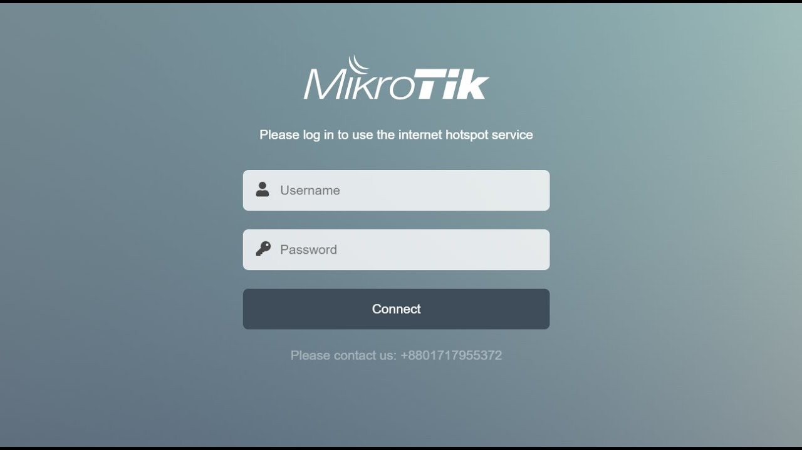

# 🔑 Custom HTML Login Page for MikroTik Hotspot

A modern **Tailwind CSS v4 + HTML/JS login page** for MikroTik Hotspot.
This replaces the default MikroTik login with a clean, responsive, and fully customizable page.

---

## 🚀 Features

* ✅ Responsive design (desktop & mobile)
* ✅ Built with **Tailwind CSS v4**
* ✅ Easy to customize via `input.css → output.css`
* ✅ Supports logo, background, and branding
* ✅ Plug-and-play with MikroTik Hotspot

---

## 📊 Default vs Custom

| Feature             | Default Login | Custom Login              |
| ------------------- | ------------- | ------------------------- |
| **Design**          | Outdated      | Modern, responsive        |
| **Customization**   | Very limited  | Full (HTML + Tailwind)    |
| **Branding**        | Hard to add   | Logo, colors, backgrounds |
| **Mobile Friendly** | No            | Yes ✅                     |

---

## ⚙️ Setup Guide

### 1. Prepare Files

Repo includes:

```
login.html
logout.html
md5.js
input.css
output.css   ← generated CSS
images/
```

### 2. Build CSS (if customizing)

1. Edit styles in `input.css` (Tailwind utility classes).
2. Run Tailwind build:

   ```bash
   npx tailwindcss -i ./input.css -o ./output.css --watch
   ```

   > This compiles your styles into `output.css`, which is linked in `login.html`.

### 3. Upload to MikroTik

1. Connect via **Winbox / WebFig / FTP**.
2. Go to **Files** → upload all project files.
3. Make sure they’re inside `/hotspot/` directory.

### 4. Apply Custom Login

1. Go to **IP → Hotspot → Server Profiles**.
2. Edit your active profile.
3. Set **HTML Directory** to:

   ```
   hotspot
   ```

### 5. Test

* Connect to your Hotspot → login redirect shows your new page.
* Try logging in with valid credentials.

---

## 🛠️ Customization

* Replace `/images/logo.png` with your own.
* Edit `input.css` (e.g., brand colors, spacing).
* Rebuild Tailwind to update `output.css`.
* Edit `login.html` for text, fields, or announcements.

---

## 📜 Notes

* Don’t remove `md5.js` → MikroTik requires it for login.
* File names must match defaults (`login.html`, `logout.html`).
* Keep a backup of the original hotspot files.

---

## 📷 Screenshots

**Before (Default)**


**After (Custom)**


---

## 📄 License

MIT – free to use and modify.
